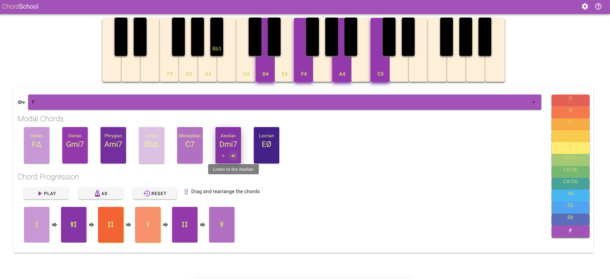
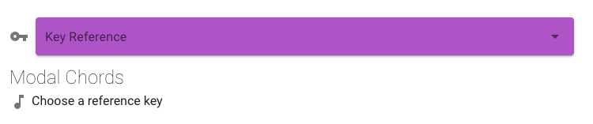
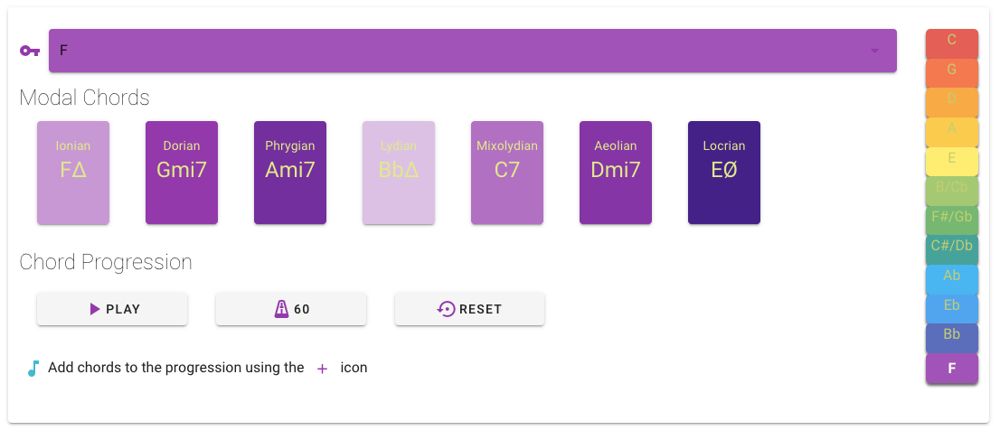
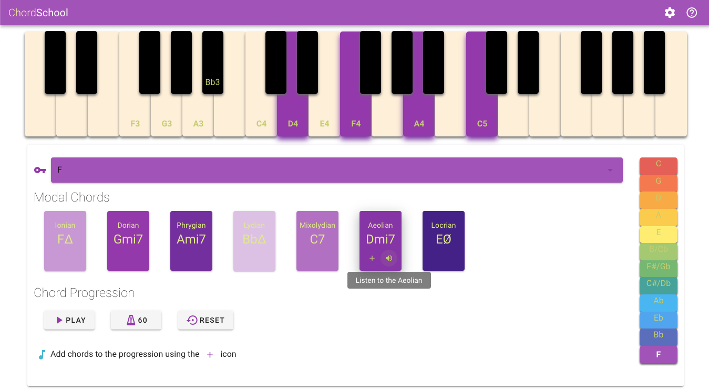
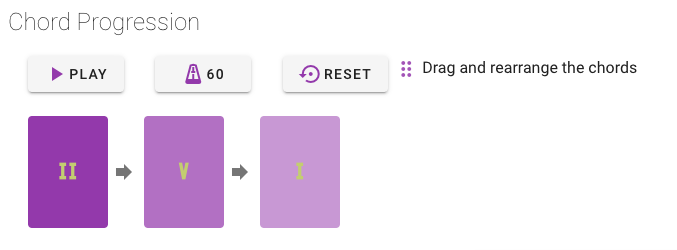
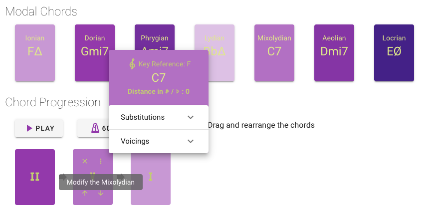
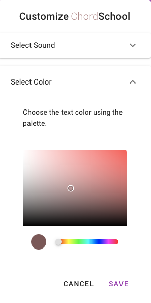
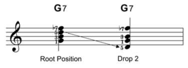
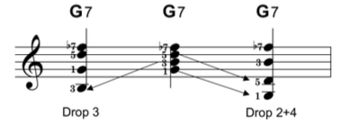
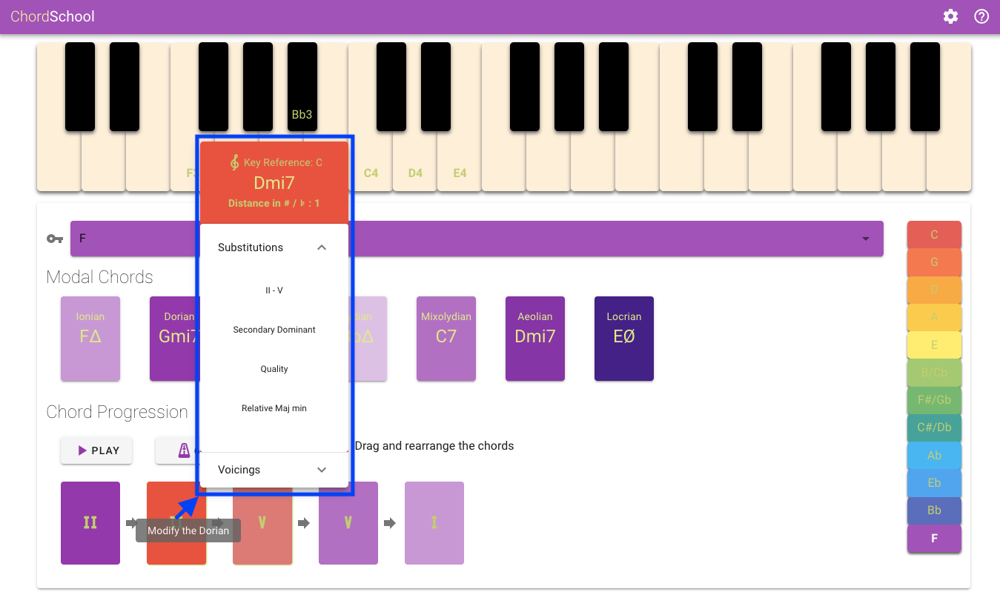

# ChordSchool Project

## Web-based Educational application to visualize Major Scale harmony chords and scales 



## Introduction

This application is a combined project between Advanced Coding Tools and Methodologies & Computer Music - Representations and Models courses.
ChordSchool is a Vue.js desktop application allowing the user to build chord progressions and experiment with the possible substitutions and voicings according to the rules of major scale harmony. 

Our application is focused on the educational aspect of Major Scale harmony, therefore we are visually representing the user choices in key references, relative chords and modes as colors as well as notes over the keyboard, so to help him visualise the relevant music theory aside from hearing the result.

The app is configured to run in all screen sizes and major browsers, so it's totally cross-platform and available for every desktop OS.

A working version of ChordSchool can be found here: https://olivieromassi.github.io/index.html

## User Interface

The ChordSchool user interfaces consists of the following  main components:
1. The **Keyboard** that extends over three octaves and is displaying the notes composing the major scale of reference as well as the placement of fingers over it for the modal chords in their first position as well as all the possible alterations when applied by the user. Please note that the keyboard is available for medium and above screen sizes.

2. The **control panel** where the user mainly interacts with the application. The user is able to create the chord progression of his choice, by placing a series of chords available from the seven modes of the reference scale. The user can reorder the progression by dragging its elements and hear the final result in different sound environments and configurable playout speed. As the user interacts with the control panel, the keyboard highlights his choices and helps him position himself over the keyboard as a player. The control panel is available for all screen sizes.

## How to Use

The ChordSchool app workflow can be summarized by the following steps:

1. Select the key reference using the selector. Each key is assigned a color 
according to their positioning on the circle of 5ths, which is displayed in the palette on the right section of the control panel.  



2. The modes of the selected reference scale are displayed in the Modal Chords section. 
Each mode is assigned a specific background color variant, according to the brightness or darkness of the mode.
For example the Lydian mode is assigned the brightest variant while Locrian mode the darkest.
The selected Key position is highlighted in the palette and the name of the notes relative to the scale are placed on the keyboard. 



3. The hovering action reveals the fingering over the keyboard and the action buttons:
    * **Add** the chord to Chord Progression section.
    * **Listen** to the chord over in its first position on the keyboard.


 
4. The added chords appear in the Chord Progression section, in the order of selection.



5. Hovering over the progression list chords reveals the fingering over the keyboard board and additional action buttons

   * **Drag** the chord within the Chord Progression section to rearrange it as needed.
   * **Move** the chord over the keyboard up or down an octave
   * **View** the chord Details menu using the Details button. The Details screen and its options are described in depth in the following section **Chord Alterations**  
   * **Remove** the chord if it is not needed
    


6. In the Chord Progression section the user can: 

    * **Play** the progression and view the fingering of the chords as the playout is moving forward in time, using the relative PLAY button
    * **Adjust** the BPM of the playout speed using the relative BPM button. 
    * **Reset** the current progression and delete all the selected chords using the RESET Button.

7. In the Settings menu the user has the ability to customize the application:

   * **Sound Settings** allowing the user to choose the sound of the playout between different instruments.
   * **Color Settings** allowing the user to set the color of the text and make it discernible in all color combinations.
   
   

## Chord Alterations

### Substitutions
In music theory, chord substitution is the technique of using a chord in place of another in a progression of chords. Much of the European classical repertoire and the vast majority of blues, jazz and rock music songs are based on chord progressions. "A chord substitution occurs when a chord is replaced by another that is made to function like the original. Usually substituted chords possess two pitches in common with the triad that they are replacing."

In the context of major scale harmony we chose to implement the following substitution mechanisms:
 
* **Tritone substitution**
The tritone substitution can be performed by exchanging a dominant seven (V degree) chord for another dominant seven chord which is a tritone away from it. For example, in the key of C major one can use D♭7 instead of G7. (D♭ is a tritone away from G).

* **Secondary dominant**
A secondary dominant is any chord that has the dominant function over another chord that is not the tonic of the song.
For example, in the key of C major, the dominant chord is G7. If, in that tonality, the A7 chord appeared, that chord would be a “secondary dominant”, since it is a dominant that resolves in D, not in C (our tonic in this case).

* **ii-V substitution**
The ii-V substitution is when a chord or each chord in a progression is preceded by its supertonic (ii7) and dominant (V7), or simply its dominant. For example, a C major chord would be preceded by Dm7 and G7. Since secondary dominant chords are often inserted between the chords of a progression rather than replacing one, this may be considered as 'addition' rather than 'substitution'.

* **Quality substitution**
Chord quality substitution is when the quality of a chord is changed, from major to minor or vice versa, so the new substitute chord has similar root and construction but with one pitch different. 

* **Relative major-minor substitution** 
The relative major/minor substitution shares two common tones and is so called because it involves the relation between major and minor keys with the same key signatures, such as C major and A minor.

* **Tonic substitution**
Tonic substitution is the use of chords that sound similar to the tonic chord (or I chord) in place of the tonic. In major keys, the chords iii and vi are often substituted for the I chord, to add interest. Both of the tonic substitute chords use notes from the tonic chord, which means that they usually support a melody originally designed for the tonic (I) chord.

### Voicings

In music theory, voicing refers to one of two closely related concepts:
* How a musician or group distributes, or spaces, notes and chords on one or more instruments
* The simultaneous vertical placement of notes in relation to each other.


One nomenclature for describing certain classes of voicings is the "drop-n" terminology, such as drop-2 voicings, drop-4 voicings, etc. This system views voicings as built from the top down. The highest voice is the first voice or voice 1. The second-highest voice is voice 2, etc. 

A dropped voicing lowers one or more voices by an octave relative to the default state.
    



We focused our implementation to the vertical spacing of notes inside a single chord:
* **drop-2**  
* **drop-3**
* **drop-2+4**
* **Add 9th**
* **Add 9th - No 5th**


The above described chord alterations are accessible to the user in the Chord Details Menu along with the following information:



1. **Key Reference**: Dynamically updated to display the key reference of the altered chord when a specific substitution is applied. In the example shown above, after applying a ii-V substitution on the V degree chord in the key of F, the ii degree chord and the a V degree chord are added, both in the key of C. 
The presence of this new key reference inside the progression can be heard using the PLAY button and moreover is visually highlighted by the change of the color of the chords according to the circle of 5ths color coding.

2. **Chord Name**

3. **Distance in semitones from the reference scale**: The chords that are in a different key from the reference scale show the distance from their key reference in semitones. Additionally, this distance is higlight as an elavation of the chord with respect to the other elements of the progression. The elevation height is proportional to the distance metric.

4. **Available Substitutions**: Contains a list of the possible substitutions to be applied on the chord, based on their degree. The result is displayed both on the progression and on the keyboard fingering.

5. **Voicings**: Contains a list of the voicings to be applied on the chord. The result is displayed on the keyboard fingering.

## Technologies Used

### Vue with Vuex

ChordSchool code is built on HTML, CSS and JavaScript exploting the Vue.js combined with Vuex State Management. Vue.js is an open-source model–view–viewmodel JavaScript framework for building user interfaces and single-page applications. Because Vuex is written with Vue, Vuex State is reactive similar to the the Vue instance’s data. When one component updates the Vuex State, other components can be listening for when that State changes, then they can reactively respond based off that state-change (and the new State value they receive).

The Vue.js library is available at https://vuejs.org/


### Vuetify
The UI of ChordSchool is built on Vuetify UI library combined with Vue and Vuex framework. Vuetify is a reusable semantic component framework for Vue.js that follows the Material Design standard used by Google. This choice has offered us the option to apply style standardization and reusable components like buttons, menus etc. with ease and with a visually satisfactory result.

The Vuetify library is available at https://vuetifyjs.com/en/


### ToneJS

Tone.js is a Web Audio framework for creating interactive music in the browser, it provides high-performance building blocks to create your own synthesizers, effects, and schedule events so to guarantee a higher level of abstraction over the Web Audio API. The sounds of the playback instruments have been designed using the PolySynth and Sampler Objects of this library.

The ToneJS library is available at https://tonejs.github.io/

### WebStorm IDE

The JetBrains WebStorm IDE allowed us to have full management of the node.js features (installation of libraries, building of the application) and full integration with the VCS. 

The JetBrain WebsStorm IDE is available at https://www.jetbrains.com/webstorm/


## Video Demo
Here's a short demo of our project: https://youtu.be/hOSSSHiEU8Q


## Building the project:
#### Project setup
```
npm install
```

#### Compiles and hot-reloads for development
```
npm run serve
```

#### Compiles and minifies for production
```
npm run build
```

Developed by
- Oliviero Massi (mail: oliviero.massi@mail.polimi.it)
- Fotios Koutsoukos (mail: fotios.koutsoukos@mail.polimi.it)
- Soroush Jamali (mail: soroush.jamali@mail.polimi.it)
